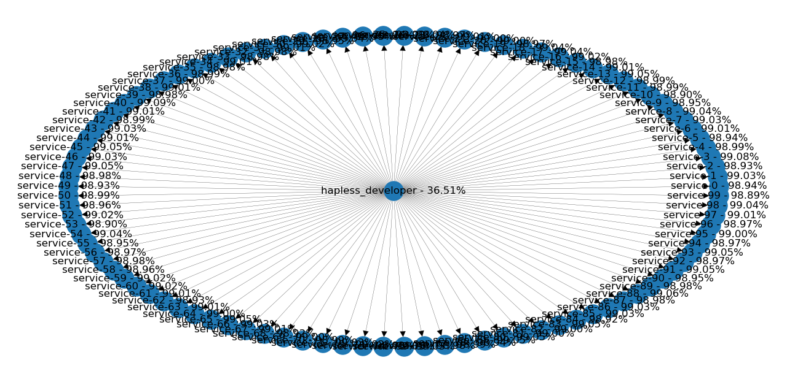
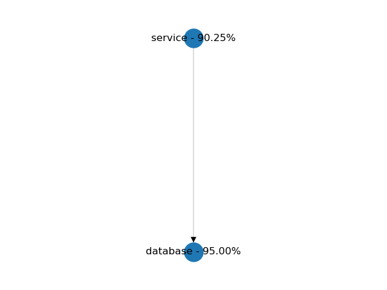

# Incorporating fault-tolerance into your microsevice design
Fault-tolerance is an essential trait of every microservice architecture. The reasons are plain simple: After integration points in our system reach a certain number, failures are going to happen on a daily basis. The reasons are simply statistical. As I will show it to the reader, we can't defy the laws of mathematics.

That's why we need to understand the key drivers of failures from a higher perspective. It's required to make strategic decisions effectively. Without these decisions it's impossible to achieve the level of fault-tolerance we aim for. 

# Types of failures
There are a plethora of different reasons for a service to fail. Without 
// TODO consider that switches, firewalls, anything between can also fail.

## Crash
The dependent service is not running and not responding to answers. The usual effect of this failure is getting back an exception on the client side.

## Hang
The dependent service is not responding to any answer, just keep chewing on the requests. The usual effect is getting a timeout on the client side

## Timeout
The service fails to response within the required time interval. Usually this only means that the client's timeout is lower than . The worst case scenario is when client retries.

## ...

# Understanding total system availability
## The model
I've created a simple [simulation][gihub-simulator-link] to model different kind of scenarios. All the results below were created by the aid of this software. At high level we don't really need a fully pfledged application with a real network stack to make these calculations. A tiny simulation is going to perform much faster and it's a lot simpler to build. It's allowing us to see the effect of scaling out our system to 100s of nodes, which would be hard to reach with real world scenarios.

## True story: Team obliged to maintain things on their own
I remember, that I was part of a team which had to provide maintenance to all the software running in 3 different environments: DEV, INT and even including PROD. There was no one else who provided support for keeping these applications alive. Back then, I had the feeling that we were reparing services on a daily basis. Not leaving time for any other activity, like coding and finishing up the milestones ahead of us. The infrastructure had many flaws. No healthchecks, no automatic restarts, we've just left using only SSH terminals and bash. One day I've counted all the different applications and components we had. In total there were almost 100 components we had to keep alive! So, let's say that we have 100 components with the "not-so-bad" 99% availability. What's the total availability of the system? In the center, we have the hapless developer. Let's assume that his availability 100% (because he's dedicated to do the job properly). The overall availability of the whole system, including all 100 components will reduce to just 36%! This means that there's no outage on one day out of 3 days. No wonder we had such a trouble making any progress.

# Serial and parallel connections
We will look at two simple examples first, to understand how dependency between each component will affect the whole system's availabilty. In brief, you can connect each one of the components either serial or parallel.

## Serial - e.g. application & database
In a serial connection both of the components should be available to serve incoming requests to the client. A service and it's database is a good example for this kind of configuration. In the example below, both component has a 95% availability in its own. Because of the dependency, the service's availability is reduced to 90%. The total availability of a serial connection is always lower, than the minimum availability of its components.

## Parallel - e.g. clustering
In a parallel connection only one of the components is required to be available to serve incoming requests to the client. Serving requests from a cluster is a good example, considering that the load balancing logic's availability is 100%. In real world scenarios, using client-side load balancing is close to this kind of setup. Let's see another example. Here, each component has 95% availability again. 

# Decomposing your services
## Mesh and star

## CRUD services
https://azure.microsoft.com/en-us/blog/microservices-an-application-revolution-powered-by-the-cloud/
https://www.edureka.co/blog/microservices-design-patterns#Branch

# Some fault-tolerance patterns and their possible effect
## retries
[Cassandra rapid read protection][cassandra-read-protection]
[gRPC retries][grpc-retries]
## fallback
## defaults

# Summary
Not just circuit breakers or service mesh
// TODO GRPC features covering these
// TODO Istio features covering these

Each additional integration point has an additional cost, that needs to be mitigated. Here's a checklist on what to evaluate on each of the connections:

- Timeouts
- Retry policy
- Periodic connection validation
-- Connection pool rotation
- Circuit breakers
- ...

# Tools & Technoloiges

# Out of scope
[Traefik]: https://docs.traefik.io/v2.0/middlewares/ratelimit/
[CNCF proxies]: https://landscape.cncf.io/category=service-proxy&format=card-mode&grouping=category&license=open-source

# References
https://eventhelix.com/RealtimeMantra/FaultHandling/system_reliability_availability.htm
https://eventhelix.com/RealtimeMantra/FaultHandling/reliability_availability_basics.htm
https://www.os3.nl/_media/2013-2014/courses/rp1/p17_report.pdf

[cassandra-read-protection]: https://docs.datastax.com/en/archived/cassandra/3.0/cassandra/dml/dmlClientRequestsRead.html
[grpc-retries]: https://github.com/grpc/proposal/blob/master/A6-client-retries.md
[gihub-simulator-link]: https://github.com/gitaroktato/microservices-availability-simulator