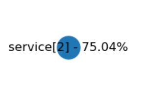
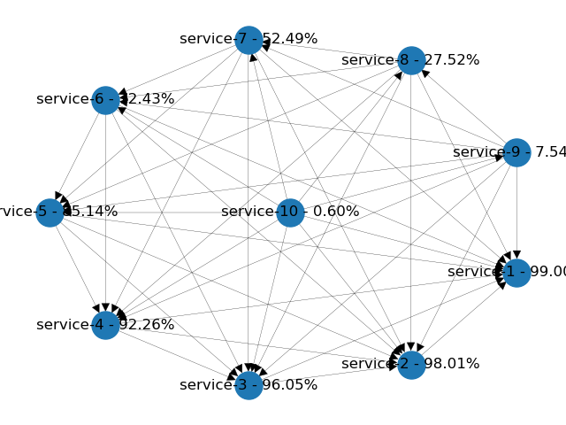
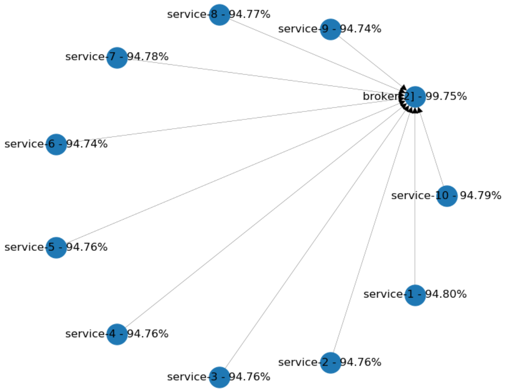

# Incorporating fault-tolerance into your microservice design
Fault-tolerance is an essential trait of every microservice architecture. The reasons are plain simple: After integration points in our system reach a certain number, failures are going to happen daily. The reasons are simply statistical. As I will show it to the reader, we can't defy the laws of mathematics.

That's why we need to understand the key drivers of failures from a higher perspective. It's required to make strategic decisions effectively. Without these decisions, it's impossible to achieve the level of fault-tolerance we aim for. 

# Understanding total system availability
## The model
I've created a simple [simulation][gihub-simulator-link] to model different kinds of scenarios. All the results below were created by the aid of this software. At a high level, we don't really need a fully fledged application with a real network stack to make these calculations. A tiny simulation is going to perform much faster and it's a lot simpler to build. It's allowing us to see the effect of scaling out our system to 100s of nodes, which would be hard to reach with real-world scenarios.

## True story: Team obliged to maintain things on their own
I remember, that I was part of a team that had to provide maintenance to all the software running in 3 different environments: DEV, INT and even including PROD. There was no one else who provided support for keeping these applications alive. Back then, I had the feeling that we were repairing services on any given day. Not leaving time for any other activity, like coding and finishing up the milestones ahead of us. The infrastructure had many flaws. No health checks, no automatic restarts, we've just left using only SSH terminals and bash. One day I've counted all the different applications and components we had. In total there were almost 100 components we had to keep alive! So, let's say that we have 100 components with the "not-so-bad" 99% availability. What's the total availability of the system? In the center, we have the hapless developer. Let's assume that his availability 100% (because he's dedicated to doing the job properly). The overall availability of the whole system, including all 100 components will reduce to just 36%! This means that there's no outage on one day out of 3 days. No wonder we had such trouble making any progress.

# Serial and parallel connections
We will look at two simple examples first, to understand how dependency between each component will affect the whole system's availability. In brief, you can connect each one of the components either serial or parallel.

## Serial - e.g. application & database
In a serial connection, both of the components should be available to serve incoming requests to the client. A service and its database is a good example of this kind of configuration. In the example below, both components have a 95% availability on their own. Because of the dependency, the service's availability is reduced to 90%. The total availability of a serial connection is always lower than the minimum availability of its components.

## Parallel - e.g. clustering
In a parallel connection, only one of the components is required to be available to serve incoming requests to the client. Serving requests from a cluster is a good example, considering that the load balancing logic's availability is 100%. In real-world scenarios, combining client-side load balancing with retries is close to this kind of setup. Let's see another example. Here, each component has a 50% availability again. We should have a total availability of 75% after the simulation is finised. The failure rate is halved, which should leave us with 1 - 0.25 availability. The total availability of a parallel connection is always higher than the availability of its components. Note, that in the python model we only allow parallel connections of the same service component.

# Decomposing your services - mesh and star
The described rules are coming into play first when we're considering how to decompose our system into multiple services. Let's imagine, that we've started with a design where every component is talking to each other without any limitation. The whole thing starts becoming a huge mess very fast and nobody understands why the site is down in the majority of the business hours. This situation can easily happen with "big bang" migration projects with a wrongly chosen service decomposition strategy. 

Let's start small and say, that we have only 10 services. Every newly added component will depend on all of the previously existing ones. This adds many layers of abstraction, but more importantly, lots of integration points to worry about! The dependency diagram of these kinds of systems often looks like a full mesh. In the python model, I've added each service with 99% availability. Each newly added service will depend on all existing nodes. The last one in the middle with all the connections has the estimated availability below 1%!

What's the conclusion? How we could improve the overall situation? Well, it's nice to build atop of existing functionality. But it's way too dangerous to encapsulate every dependency with a network call. We should aim to minimize the number of integration points and create larger services. Rather than that, reuse dependencies using your dependency management tool. You can even duplicate functionalities and implement them multiple times if you have to.
In a situation like this, reversing integration calls, merging services and reimplementing some of the functionalities can help.

## Shifting towards star topology
Now, let's see another topology. Let's assume that every component in our system is communicating through a "broker". Will this change our availability in a positive way?

In the diagram below every service has 95% availability. Each one of them has only one dependency: The cluster of brokers in the middle. We're using 2 separate brokers with 95% availability. You can see, that the availability improved overall. Clustering increases the availability of the brokers up to 99.75% and each service lost just a proportional amount of their availability.

What are these examples telling us? So, if you really need to have such complexity in the dependencies between services it's better to use messaging as the communication channel. You'll need to look at [enterprise integration patterns][eip-patterns] to figure out how to implement some of the most challenging scenarios.

Message-driven architectures often have a message broker in the middle, implemented by Kafka or RabbitMQ or similar technology. This kind of setup aims to keep pushing the common dependency's availability and reliability. This can be achieved, more or less, by the following techniques.

### Eliminating single point of failures from deployments
Careful evaluation of the chosen technology's configuration can help you avoid a lot of headaches. This is not so simple as it sounds and often needs dedicated personnel for properly provisioning the cluster for you.
If you're using cloud providers, check the availability of managed services. For instance, AWS is offering SQS, SNS and managed Kafka clusters as well.

### Partitioning your brokers
Even if you're confident in the chosen technology, it's advisable to partition your cluster of brokers amongst the teams. It's going to help when you need to roll out new configurations or improvements. For instance, you can deliver them to a single partition at first and then back off if something goes wrong. 

# Two common microservice patterns and their effect on availability
Now, let's look at how we can apply what we've learned by analyzing the two most common microservice patterns. 

## CRUD services and aggregates
Often teams encapsulate specific data types with simple CRUD services, lacking any business logic. In these cases, you have to push business logic in the layer above, usually into an aggregate that joins data by calling several CRUD services. As an alternative, you can merge business logic and just reduce the number of integration points. But let's see a not-so straightforward scenario. Again, in this case, the availability of each individual service is 95% on its own.

We have two CRUD services called by an aggregate. Let's suppose we want to get rid of an integration point, by merging `another_crud` into `aggregate`. We suspect that the availability looked from the proxy's perspective will increase, so let's do a little simulation and examine the results.

Surprisingly we lost 6.5% of availability! But why? The reason is that we accidentally increased the outbound dependencies of the `aggregate` from 2 to 3. And this made our system's availability  worse. 

So, the model showed us that we shouldn't stop there. We won't reach the desired effect until we merge both CRUD services into the `aggregate`, which will remind us to a bit more monolithic design.

## Chained calls
Another common pattern is to form a chain with each service call to simplify data aggregation. In the example below would it be more beneficial to get both the user data and the cart information from the BFF? It's easy to find out by setting up the simulation and evaluating the results.

We get somewhat equal availability from both setups, so I say simplicity should be the dealbreaker here. We should consider reusability of the cart service if user data is included with every related cart information. Also, we need to take into account which service should provide meaningful defaults if user information can't be received within time. Are these defaults going to be the same in each use-case or different? A user page should be much more sensitive for a failing user request, than a shopping cart page. So the latter design might be more extensible, than the former. Anyway, it's good to know that availability has no significant role in these kinds of decisions.

# Summary
I've seen a few use-cases when the total availability of the microservice composition was not feasible at all, so I decided to create my own simulation to help to demonstrate the effect of high-level architectural decisions. As we've seen there are many situations, when it's not self-explanatory whenever the results will have a positive or negative effect. It's good to be aware of other fault-tolerance related patterns though, these also play a significant role in making our services more resilient.

You can introduce each of these pattern implementations locally in your own service, by using a  library, or centrally into a proxy or a service mesh.  

## Retries
[Cassandra rapid read protection][cassandra-read-protection] is a very good example. This built-in functionality ensures that an additional request will be sent if the response is not arriving within a specified timeframe. [Resilience4J][Resilience4j] implements many fault tolerance patterns, including retries. You even have the option to configure [exponential backoff][exponential-backoff] with some level of randomness to your retry strategies. If you're looking for a centralized solution, the most popular proxies and service meshes have these implemented, like [Traefik][Traefik] or [Istio][Istio].

## Exponential backoff
It's higly preferable to add exponential backoff and jitter to your retry strategy to avoid services forming a [thundering herd][thundering-herd] over your scarce resource. [Envoy][envoy-retry-algorithm] proxy offers a default backoff algorithm for example.

## Fallback & Defaults
Whenever a depending service is not available you should still have the choice of returning an outdated value from cache or some defaults. Since most of the cases fallbacks & defaults are tightly coupled to the domain it can be introduced only in your application code. [Resilience4J][Resilience4J-defaults] is offering some out-of-the-box implementations, like `fallbackMethod` attribute in their Spring annotations.

## Circuit Breakers
The circuit breaker is the most known stability pattern. The most popular implementation is [Hystrix][hystrix]. But it's available in almost all commonly used service meshes, proxies, and libraries, like [Istio], [Envoy], [Traefik] or [Resilience4J].
// TODO links

## Timeouts
Your already used connection library should provide timeouts out-of-the-box. For instance, if you're using Spring Boot you should have [Hikari CP][hikari-cp] configured for your JDBC pool. You should review the default timeout settings and set a more sane value because the defaults are usually too high. Most of the cases it's 30 seconds so make sure you dial it down a bit. 

# References
[eip-patterns]: https://www.enterpriseintegrationpatterns.com/patterns/messaging/

## Reliability, availability
https://eventhelix.com/RealtimeMantra/FaultHandling/system_reliability_availability.htm
https://eventhelix.com/RealtimeMantra/FaultHandling/reliability_availability_basics.htm

## Whitepapers
https://www.os3.nl/_media/2013-2014/courses/rp1/p17_report.pdf

## Articles
https://azure.microsoft.com/en-us/blog/microservices-an-application-revolution-powered-by-the-cloud/
https://www.edureka.co/blog/microservices-design-patterns#Branch

[gihub-simulator-link]: https://github.com/gitaroktato/microservices-availability-simulator

## Retries
https://docs.aws.amazon.com/general/latest/gr/api-retries.html
https://www.baeldung.com/resilience4j-backoff-jitter
https://github.com/googleapis/google-http-java-client/blob/master/docs/exponential-backoff.md
https://aws.amazon.com/blogs/architecture/exponential-backoff-and-jitter/
https://github.com/grpc/proposal/blob/master/A6-client-retries.md
[cassandra-read-protection]: https://docs.datastax.com/en/cassandra-oss/3.x/cassandra/dml/dmlClientRequestsRead.html?hl=rapid%2Cread%2Cprotection#dmlClientRequestsRead__speculative-retry
[Resilience4j]: https://resilience4j.readme.io/docs/retry
[exponential-backoff]: https://resilience4j.readme.io/docs/retry#section-use-a-custom-intervalfunction
[thundering-herd]: https://en.wikipedia.org/wiki/Thundering_herd_problem

### Retries central control plane
[envoy-retry-algorithm]: https://www.envoyproxy.io/docs/envoy/v1.13.0/configuration/http/http_filters/router_filter#x-envoy-max-retries
[Traefik]: https://docs.traefik.io/v2.0/middlewares/retry/
[Istio]: https://istio.io/docs/concepts/traffic-management/#retries

# Timeouts
[hikari-cp]: https://github.com/brettwooldridge/HikariCP#configuration-knobs-baby
https://commons.apache.org/proper/commons-dbcp/configuration.html
https://dev.mysql.com/doc/connector-j/5.1/en/connector-j-reference-configuration-properties.html

# Fallbacks & Defaults
[Resilience4J-defaults]: https://resilience4j.readme.io/docs/getting-started-3#section-annotations

## Other interesting links
[Traefik]: https://docs.traefik.io/v2.0/middlewares/ratelimit/
[CNCF proxies]: https://landscape.cncf.io/category=service-proxy&format=card-mode&grouping=category&license=open-source