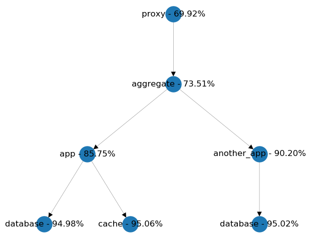
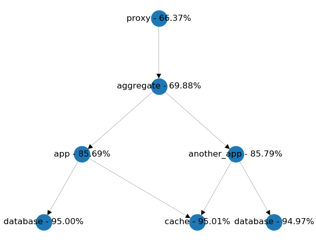

# microservices-availability-simulator
A software that's using Monte Carlo simulation for showing availability of combination of microservices

# Usage
See `main.py` as an example on how to use the simulator. You need the following libraries installed:
- `networkx`
- `mathplotlib`

# Screenshots

# References

## NxGraph used as a graph library
- https://www.geeksforgeeks.org/python-visualize-graphs-generated-in-networkx-using-matplotlib/

## Whitepaers describing relevant topics
- https://www.csl.cornell.edu/~delimitrou/papers/2019.ispass.qsim.pdf
- https://pdfs.semanticscholar.org/9db6/980f217c4108dc519f35f2d5a1642d3c1421.pdf
- http://perfdynamics.com/Tools/PDQ.html