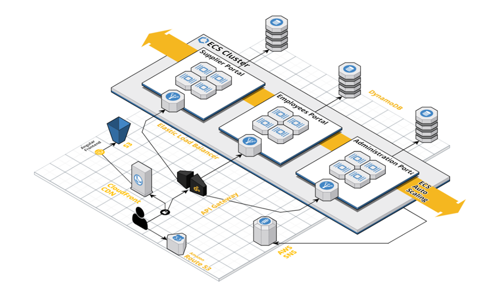
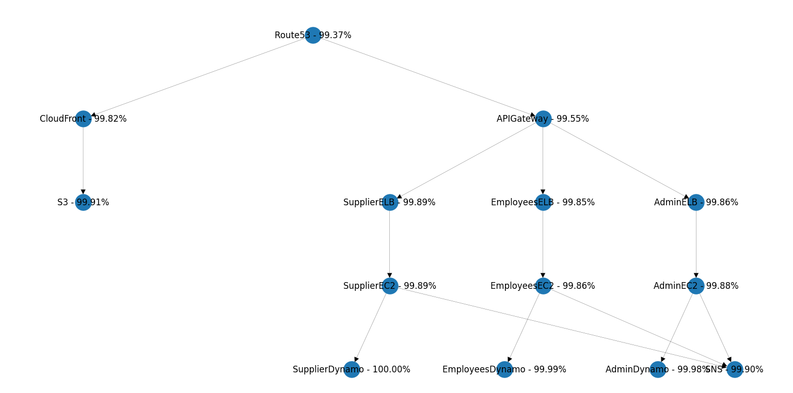

# BMS Deployment Example
This deployment diagram is representing a booking management architecture, using basic AWS components.


You can represent the same deployment diagram with the code snippet below
```python
route53 = Route53('Route53')
s3 = S3('S3')
cloud_front = CloudFront('CloudFront')
cloud_front.add_dependency(s3)
route53.add_dependency(cloud_front)
api_gateway = APIGateway('APIGateway')
route53.add_dependency(api_gateway)
# Supplier
supplier_elb = ELB('SupplierELB')
supplier_ec2 = EC2MultiAZ('SupplierEC2')
supplier_dynamo = DynamoDB('SupplierDynamo')
supplier_elb.add_dependency(supplier_ec2)
supplier_ec2.add_dependency(supplier_dynamo)
api_gateway.add_dependency(supplier_elb)
# Employees
employees_elb = ELB('EmployeesELB')
employees_ec2 = EC2MultiAZ('EmployeesEC2')
employees_dynamo = DynamoDB('EmployeesDynamo')
employees_elb.add_dependency(employees_ec2)
employees_ec2.add_dependency(employees_dynamo)
api_gateway.add_dependency(employees_elb)
# Administration
administration_elb = ELB('AdminELB')
administration_ec2 = EC2MultiAZ('AdminEC2')
administration_dynamo = DynamoDB('AdminDynamo')
administration_elb.add_dependency(administration_ec2)
administration_ec2.add_dependency(administration_dynamo)
api_gateway.add_dependency(administration_elb)
# SNS
sns = SNS('SNS')
administration_ec2.add_dependency(sns)
employees_ec2.add_dependency(sns)
supplier_ec2.add_dependency(sns)
```

You need to initiate the simulation from the root which is the Route53 component in this case:
```python
# Simulating calls in cycles
cycles = 100000
for _ in range(cycles):
    route53.call()
# Drawing from root
draw = Draw()
draw.draw_tree(route53)
```

You can find a working example code in the [bms-deployment.py](bms-deployment.py) file.
It will produce the diagram below, showing you the total availability of the system, which is **99.37%**
 